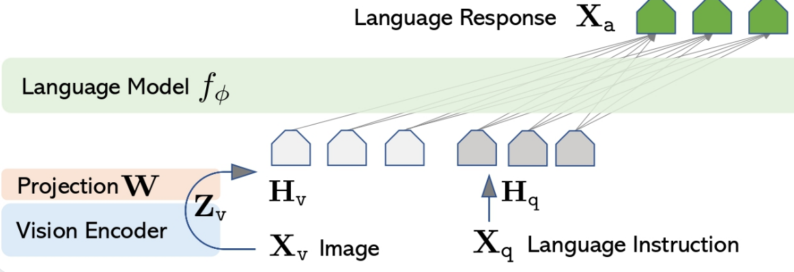

- llava(large language and vision assistant)

# 架构介绍

llava模型由3个部分组成，视觉编码器，一个简单的线性层和大语言模型。

$X_q$大预言指令被编码成$H_q$, $X_v$图像经过视觉编码器编码成$Z_v$，之后经过投影矩阵W获得$H_v$，最终$H_v$和$H_q$相同维度，之后经过大预言模型给出response

原论文架构：

- vision encoder：使用pre-trained CLIP的visual encoder ViT-L/14，得到visual feature($Z_v$)=g($X_v$)

- projection W:一个简单的线性层，使用可训练的投影矩阵W，将视觉特征Z_v投影成language embedding tokens$H_v$（visual tokens），使得$H_v$和文本特征$H_q$在同一特征维度；也可以使用更加复杂的比如gated cross-attention in Flamingo和Q-former in BILP-2来代替

  - 使用原因：考虑最后一个Transformer层的之前和之后的网络特征

    > [!NOTE]
    >
    > 不懂

    

- language model: 生成word embedding, 给出回答，原论文中使用vicuna（因为它在大语言任务拥有最好的instruction following capabilities）

> [!NOTE]
>
> 所以W的目的仅仅是让H_w和H_q相同维度吗，图像编码器具体怎么做的，投影具体怎么做的，

